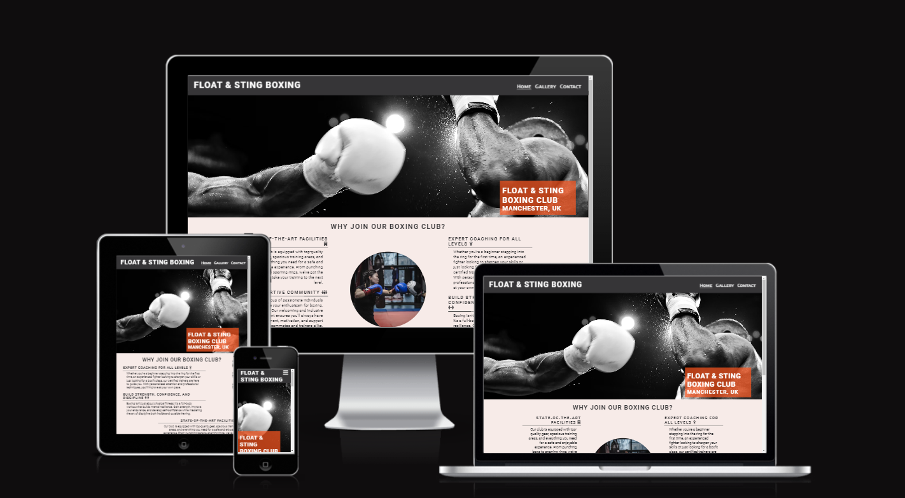
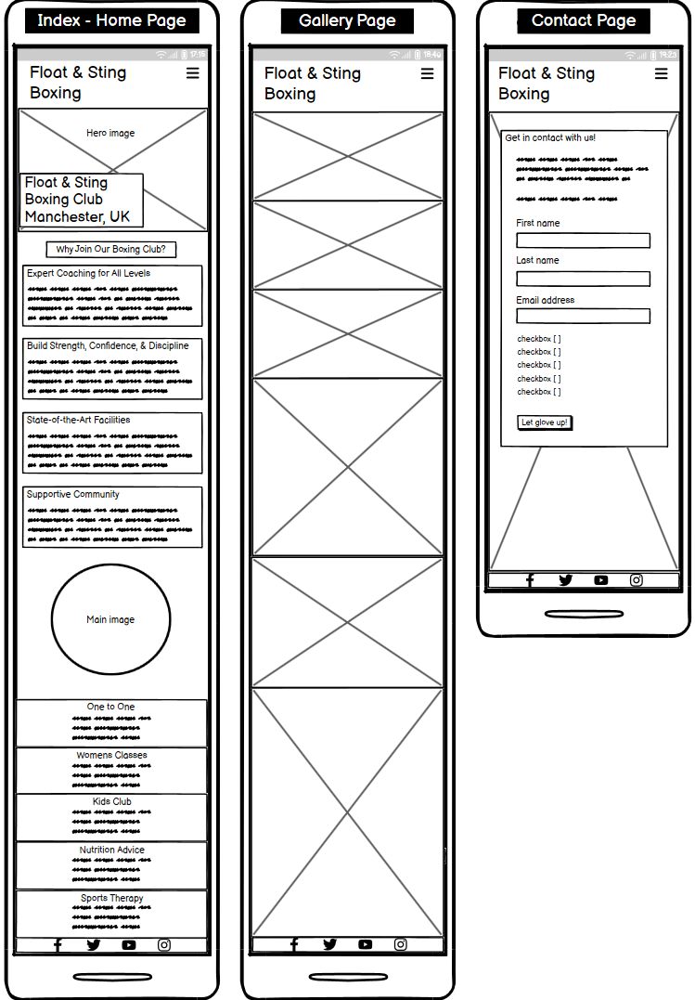
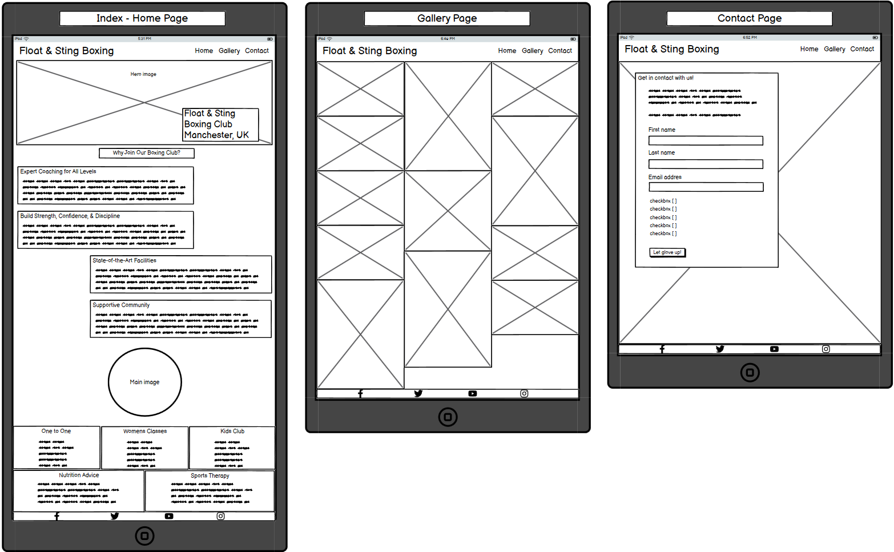
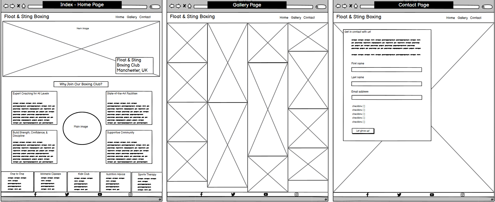
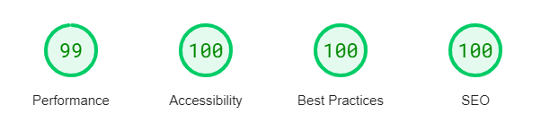
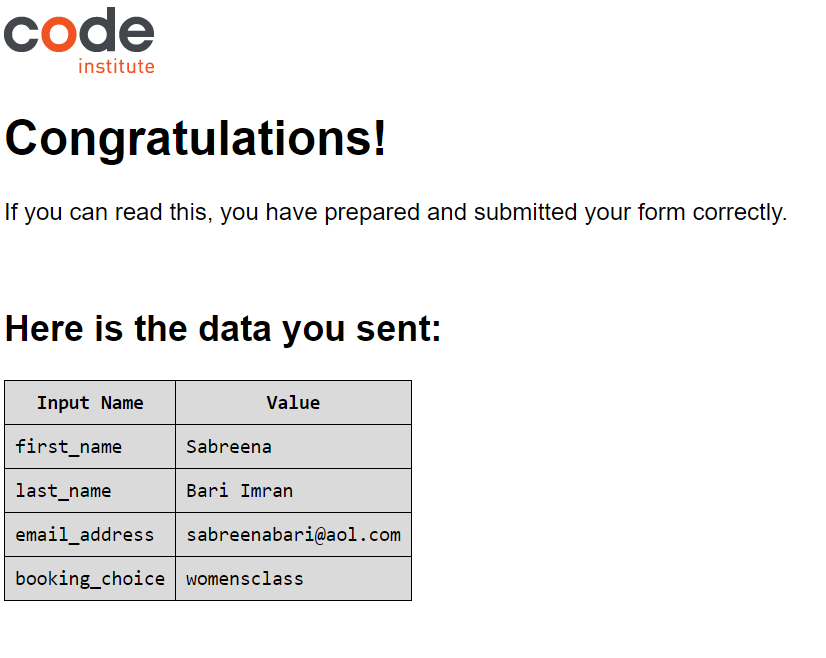
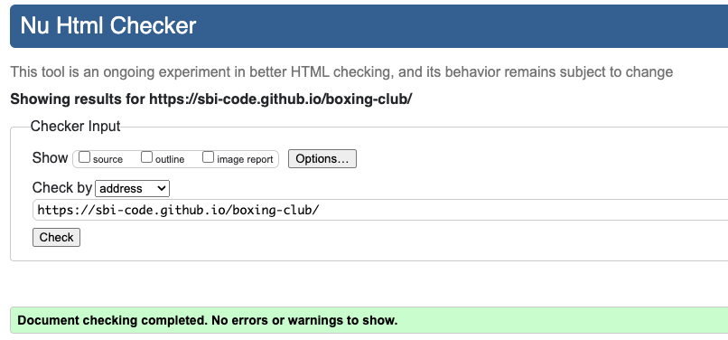
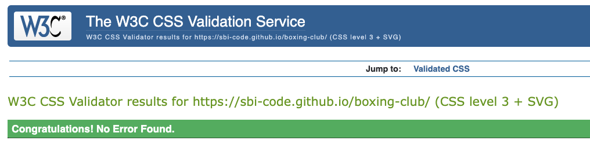

# Float & Sting Boxing

[View the live project here](https://sbi-code.github.io/boxing-club/)

This is the website for Float & Sting Boxing Club. It is designed to be respinsive and accessible on a range of devices, allowing users to navigate the site easily.

External user’s goal:
* The sites users are boxing club members and potential members, who want to know more about the club, sessions, other treatments and events.  

Site owner's goal:
* The boxing club is interested in attracting and retaining members. 

Potential features to include:
* Showcase photos of people boxing, having fun, the equipment that is available to use and other media to attract and motivate people to come. 
* Provide detail on the organised classes, one to one sessions and their schedule.
* Provide information on the boxing clubs location, opening hours, contact details and any external resources. 



## User Experience (UX)

### User stories 
* #### User Story 1: User friendly navigation and responsive design (must-have) 
    As a first-time visitor, I need easy navigation and a user-friendly design, including a responsive layout for my device, so I can find information quickly and efficiently.
    
    Acceptance Criteria:
    * The website is fully responsive across various devices and screen sizes.
    * Site layout and navigation are intuitive, allowing easy access to different sections.

    Tasks: 
    * Apply responsive design principles using CSS3 to ensure the website is accessible on various devices.
    * Arrange the site layout and navigation based on best practices, ensuring all key sections and pages are easily accessible.

* #### User Story 2: Images and engaging descriptions (must-have)
    As someone who is new to boxing, I want to see images and engaging descriptions of the boxing club offerings and the classes I can attend, so I can decide if it's the right place for me.
    
    Acceptance Criteria:
    * The homepage features an image that spans across the page showcasing a boxer that is responsive and reveals other aspects of the image on larger screens.
    * Engaging descriptions of the available classes are displayed clearly and concisely within the site's content.
    * The homepage layout prominently features the images and descriptions in an uncluttered manner.

    Tasks: 
    * Integrate images of boxers and some of the equipment available for use.
    * Embed the provided engaging descriptions for the clubs atmosphere and list of classes available within the site's content.
    * Design and implement a homepage layout that prominently features the images and descriptions.

* #### User Story 3: Showcase boxers and the club setting on a separate Gallery page (must-have)
    As a boxing fan, I want to explore a selection showcased boxers on the website, so I can discover up and coming athletes, interrogate the setting and equipment available for use and decide if I might be interested in taking part in a class or a longer term membership.
    
    Acceptance Criteria:
    * The website has a dedicated section for the list of classes and sessions.
    * The club gallery page utilises the Bootstrap grid and card components for consistency in layout and responsiveness.
    * Each card states the class name, image, dates, times, and age suitability.

    Tasks:
    * Create a responsive Club Gallery page featuring prominent boxers, the club setting and equipment.

* #### User Story 4: Location, contact details and opening hours (must-have)
    As a prospective member, I need to find essential information such as location, contact details, and opening hours clearly and concisely, so I can easily plan my classes or get in touch with the club.

    Acceptance Criteria:
    * The website contains a dedicated section for location, contact details, and opening hours.
    * This section is clearly visible and accessible from all parts of the website.

    Tasks:
    * Design and place a section for location, contact details, and opening hours using information.
    * Ensure the contact section is clearly visible and accessible from all parts of the website, adhering to common design standards.

* #### User Story 5: Contact us inquiry form (must-have)
    As a member, I want to book a group class or a one to one session using a simple booking inquiry form, so I can easily organise my workouts.
    
    Acceptance Criteria:
    * A booking inquiry form for group classes or one to one sessions is easy to find, and the form is simple and easy to use.
    * The form includes all necessary fields to gather details: Name, Email, Phone Number, Class Type and Message. Event types are: Group Class, One to One Training, Nutrition advice, Sports therapy.
    * All fields on the form must be completed before the user can submit the form.
    * When the form is completed correctly, the user is taken to a success page.

    Tasks: 
    * Implement a booking inquiry form on the website.
    * Implement HTML validation on the form to fit the requirements above.
    * Create a success page to direct users to after submitting the form.

* #### User Story 6: Visible pricing for sessions and membership levels (should-have)
    As a potential frequent user, I want to find clear information about upcoming sessions, pricing, membership levels and any related discounts, so I can plan my visit within my budget and time constraints.

    Acceptance Criteria:
    * Clear and accurate pricing information for sessions is displayed and easy to find.
    * Membership and discount information stands out near pricing information. 

    Tasks: 
    * Display pricing for sessions using the provided rate information.
    * Clearly display multiple session discount information with the pricing for sessions.
    * Clearly display membership information with the pricing for sessions. 

* #### User Story 7: Testimonials (could-have)
    As a prospective member, I want to read testimonials and reviews from other members, so I can gauge the experiences of others and feel more confident about visiting Float & Sting Boxing.

    Acceptance Criteria:
    * The website includes a section dedicated to displaying testimonials and reviews.
    * Testimonials are clearly visible and presented in a format that is easy to read and navigate.

    Tasks: 
    * Create a static section on the website for customer testimonials.
    * Populate this section with a selection of pre-written testimonials.

* #### User Story 8: Newsletter sign up form (could-have)
    As a regular member, I want to sign up for newsletters and updates, so I can stay informed about special offers, latest news, and upcoming events.

    Acceptance Criteria:
    * The website contains a sign up form for the club newsletter.
    * The sign up form is placed in the footer on every page, so that users can easily find it.

    Tasks: 
    * Integrate the newsletter sign-up form into the website footer.

### Design

#### Color Scheme
* The main colors that are used are 

#### Typography
* The Encode Sans SC and Roboto fonts are used thorughout the website with Sans Serif as the fallback font in case for any reason the chosen fonts aren't being imported correctly to the site. Both Encode Sans SC and Roboto fonts are clear and well structured so they are suited to the genre of the site.

#### Imagery 
* The images used are relevent to teh sites purpouse and are intended to attract the users attention. The hero image responds to adjusted screen sizes and reveals more of the image. The reasons section image has been made circular for smaller screens and extends to an oval shape on larger screens revealing more image content. 

### Wireframes 
* When designing and planning content positioning for the website I used wireframe to plot the layout for all the pages on mobile first and being responsive on bigger screens.     

The following displays the different interfaces on Home, Gallery and Contact pages for mobile, tablet and desktop. 

* Mobile screens from 280px

 

* Tablet screens from 768px

 

* Desktop screens from 1200px



## Features
* Responsive on all device sizes, including mobile, tablet and desktop. 
* Interactive elements such as the nav bar and contact form. 


## Technologies Used

### Languages Used

* [HTML5](https://en.wikipedia.org/wiki/HTML5)
* [CSS3](https://en.wikipedia.org/wiki/Cascading_Style_Sheets)

### Frameworks, Libraries & Programs Used

1. Hover.css:
    * Hover.css was used on the navbar to underline each page when you hover over the title.
1. Google Fonts:
    * Google fonts were used to import the 'Encode Sans SC' and 'Roboto' fonts into the style.css file which is used on all pages throughout the project.
1. Font Awesome:
    * Font Awesome was used on all pages throughout the website to add icons throughout all pages for aesthetic and UX purposes.
1. Git:
    * Git was used for version control by utilizing the Gitpod terminal to commit to Git and Push to GitHub.
1. GitHub:
    * GitHub is used to store the projects code after being pushed from Git.
1. Unsplash and Pexels:
    * Unsplash and Pexels were used to download free photos for all the pages of the website.
1. Balsamiq:
    * Balsamiq was used to create the wireframes during the design process.


## Testing

I ran the page through Lighthouse to ensure my site is easy to read and nicely accessible.

 

* I tested the site on Google Chrome, Safari and Firefox, and it functions well on these browsers.
* I tested all links on the pages to ensure they were working as intended.
* I tested all external links to ensure they work.
* I tested the contact form and it submits the all the information succesfully.

 

* HTML 
  * The W3C Markup Validator Service was used to validate every page of the project to ensure there were no syntax errors or warnings in the project.

  
 
* CSS
  * The W3C CSS Validator Service was used to validate every page of the project to ensure there were no syntax errors or warnings in the project.

   


## Deployment

### GitHub Pages

The project was deployed to GitHub Pages using the following steps...

1. Log in to GitHub and locate the [GitHub Repository](https://github.com/)
2. At the top of the Repository, locate the "Settings" Button on the menu.
3. Scroll down the Settings page until you find the "GitHub Pages" Section.
4. Under "Source", click the dropdown called "None" and select "Master Branch".
5. Scroll back down through the page to locate the now published site [link](https://github.com) in the "GitHub Pages" section.

### Forking the GitHub Repository

By forking the GitHub Repository we make a copy of the original repository on our GitHub account to view and/or make changes without affecting the original repository by using the following steps...

1. Log in to GitHub and locate the [GitHub Repository](https://github.com/)
2. At the top of the Repository (not top of page) just above the "Settings" Button on the menu, locate the "Fork" Button.
3. You should now have a copy of the original repository in your GitHub account.

### Making a Local Clone

1. Log in to GitHub and locate the [GitHub Repository](https://github.com/)
2. Under the repository name, click "Clone or download".
3. To clone the repository using HTTPS, under "Clone with HTTPS", copy the link.
4. Open Git Bash
5. Change the current working directory to the location where you want the cloned directory to be made.
6. Type `git clone`, and then paste the URL you copied in Step 3.

```
$ git clone https://github.com/YOUR-USERNAME/YOUR-REPOSITORY
```

7. Press Enter. Your local clone will be created.

```
$ git clone https://github.com/YOUR-USERNAME/YOUR-REPOSITORY
> Cloning into `CI-Clone`...
> remote: Counting objects: 10, done.
> remote: Compressing objects: 100% (8/8), done.
> remove: Total 10 (delta 1), reused 10 (delta 1)
> Unpacking objects: 100% (10/10), done.
```

Click [Here](https://help.github.com/en/github/creating-cloning-and-archiving-repositories/cloning-a-repository#cloning-a-repository-to-github-desktop) to retrieve pictures for some of the buttons and more detailed explanations of the above process.

### Version Control

* The site was created using the Gitpod editor and pushed to the remote boxing club repository on Github.com
* Git commands were used regularly during the development of the website using the following Git commands;
    - git add .  - to add files to the staging area before being committed.
    - git commit -m "commit description" - to commit a file to the queue ready for the final command.
    - git push - used to send the committed files to the Github repository.

### Deployment to Github pages

  - I used the following steps to deploy using the Github pages as follows
  - Once inside the repository, I clicked on the settings tab
  - I then went to the pages section
  - Making sure the main branch was selected I then clicked on save and the page URL was created.
  - Please click here to find the live site [BDA Fishing](https://rick-8.github.io/fishingclub/)

### Using Gitpod

  - To set up my working IDE I logged in to Gitpod and navigated to the workspaces section
  - Clicking on new workspace and in putting the repository URL, 
  - The IDE was created.

### Acknowledgements

* My Mentor for continuous helpful feedback.

* Tutor support at Code Institute for their amazing help and support.

* I would also like to credit the Love Running project walkthrough, for inspiration on the layout of the Home, Gallery and Contact pages for the header, main, footer and basic page design.


