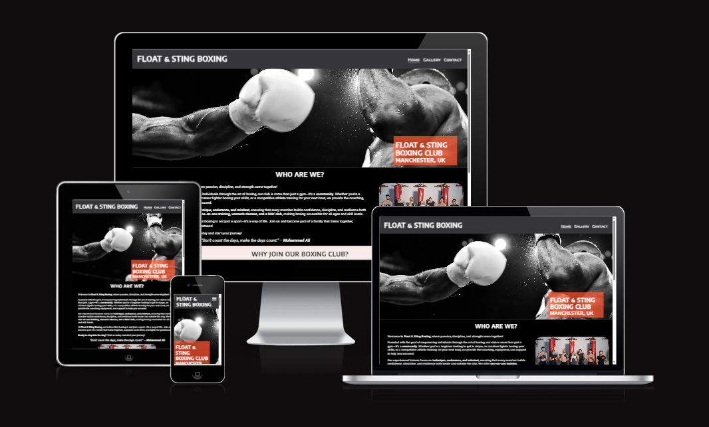
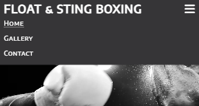
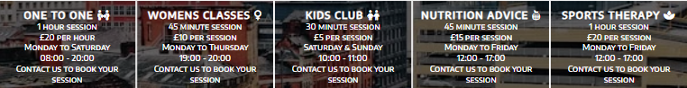
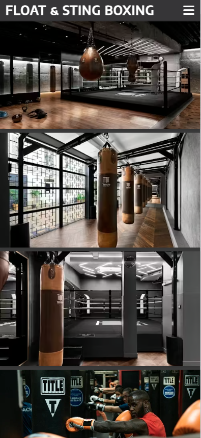
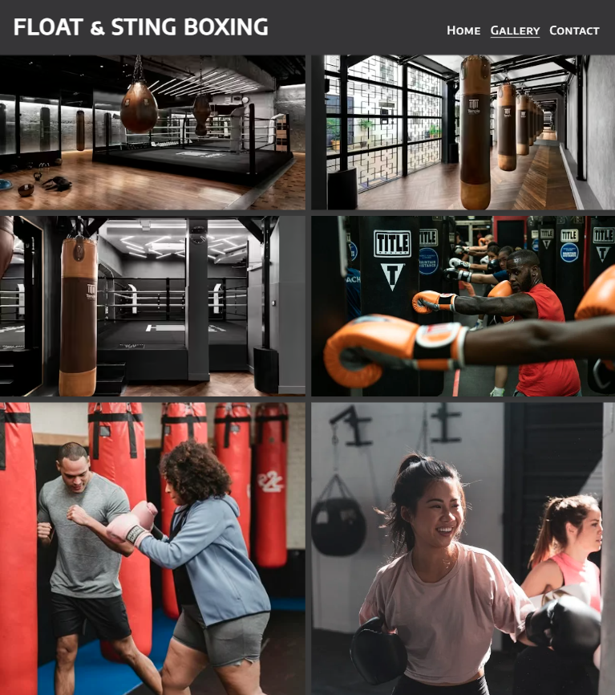
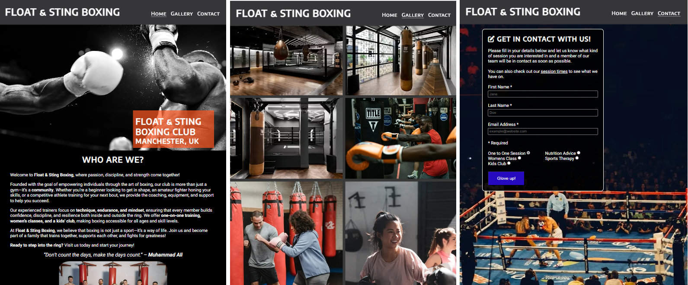

# Float & Sting Boxing

[View the live project here](https://sbi-code.github.io/boxing-club/)

This is the website for Float & Sting Boxing Club. It is designed to be responsive and accessible on a range of devices, allowing users to navigate the site easily. 
Care and thought was put into the club name, which pays homage to the professional boxer and activist Muhammad Ali by playing on a famous quote from him; "Float like a butterfly. Sting like a bee. You can't hit what your eyes don't see." to be admired by any boxing fanatic.

External user’s goal:
* The sites users are boxing club members and potential members, who want to know more about the club, sessions, other treatments and events.  

Site owner's goal:
* The boxing club is interested in attracting and retaining members. 

Potential features to include:
* Showcase photos of people boxing, having fun, the equipment that is available to use and other media to attract and motivate people to come. 
* Provide detail on the organised classes, one to one sessions and their schedule.
* Provide information on the boxing clubs location, opening hours, contact details and any external resources. 

## User Experience (UX)

### User stories 
* #### User Story 1: User friendly navigation and responsive design (must-have) 
    As a first-time visitor, I need easy navigation and a user-friendly design, including a responsive layout for my device, so I can find information quickly and efficiently.
    
    Acceptance Criteria:
    * The website is fully responsive across various devices and screen sizes.
    * Site layout and navigation are intuitive, allowing easy access to different sections.

    Tasks: 
    * Apply responsive design principles using CSS3 to ensure the website is accessible on various devices.
    * Arrange the site layout and navigation based on best practices, ensuring all key sections and pages are easily accessible.

* #### User Story 2: Images and engaging descriptions (must-have)
    As someone who is new to boxing, I want to see images and engaging descriptions of the boxing club offerings and the classes I can attend, so I can decide if it's the right place for me.
    
    Acceptance Criteria:
    * The homepage features an image that spans across the page showcasing a boxer that is responsive and reveals other aspects of the image on larger screens.
    * Engaging descriptions of the available classes are displayed clearly and concisely within the site's content.
    * The homepage layout prominently features the images and descriptions in an uncluttered manner.

    Tasks: 
    * Integrate images of boxers and some of the equipment available for use.
    * Embed the provided engaging descriptions for the clubs atmosphere and list of classes available within the site's content.
    * Design and implement a homepage layout that prominently features the images and descriptions.

* #### User Story 3: Showcase boxers and the club setting on a separate Gallery page (must-have)
    As a boxing fan, I want to explore a selection showcased boxers on the website, so I can discover up and coming athletes, interrogate the setting and equipment available for use and decide if I might be interested in taking part in a class or a longer term membership.
    
    Acceptance Criteria:
    * The website has a dedicated section for the list of classes and sessions.
    * The club gallery page utilises the Bootstrap grid and card components for consistency in layout and responsiveness.
    * Each card states the class name, image, dates, times, and age suitability.

    Tasks:
    * Create a responsive Club Gallery page featuring prominent boxers, the club setting and equipment.

* #### User Story 4: Location, contact details and opening hours (must-have)
    As a prospective member, I need to find essential information such as location, contact details, and opening hours clearly and concisely, so I can easily plan my classes or get in touch with the club.

    Acceptance Criteria:
    * The website contains a dedicated section for location, contact details, and opening hours.
    * This section is clearly visible and accessible from all parts of the website.

    Tasks:
    * Design and place a section for location, contact details, and opening hours using information.
    * Ensure the contact section is clearly visible and accessible from all parts of the website, adhering to common design standards.

* #### User Story 5: Contact us inquiry form (must-have)
    As a member, I want to book a group class or a one to one session using a simple booking inquiry form, so I can easily organise my workouts.
    
    Acceptance Criteria:
    * A booking inquiry form for group classes or one to one sessions is easy to find, and the form is simple and easy to use.
    * The form includes all necessary fields to gather details: Name, Email and Class Type. Event types are: Group Class, One to One Training, Nutrition advice, Sports therapy.
    * All fields on the form must be completed before the user can submit the form.
    * When the form is completed correctly, the user is taken to a success page.

    Tasks: 
    * Implement a booking inquiry form on the website.
    * Implement HTML validation on the form to fit the requirements above.
    * Create a success page to direct users to after submitting the form.

* #### User Story 6: Visible pricing for sessions (should-have)
    As a potential frequent user, I want to find clear information about upcoming sessions, pricing, and any related discounts, so I can plan my visit within my budget and time constraints.

    Acceptance Criteria:
    * Clear and accurate pricing information for sessions is displayed and easy to find.
    * Membership and discount information stands out near pricing information. 

    Tasks: 
    * Display pricing for sessions using the provided rate information.
    * Clearly display multiple session discount information with the pricing for sessions.
    * Clearly display membership information with the pricing for sessions. 

* #### User Story 7: Testimonials (could-have)
    As a prospective member, I want to read testimonials and reviews from other members, so I can gauge the experiences of others and feel more confident about visiting Float & Sting Boxing.

    Acceptance Criteria:
    * The website includes a section dedicated to displaying testimonials and reviews.
    * Testimonials are clearly visible and presented in a format that is easy to read and navigate.

    Tasks: 
    * Create a static section on the website for customer testimonials.
    * Populate this section with a selection of pre-written testimonials.

* #### User Story 8: Newsletter sign up form (could-have)
    As a regular member, I want to sign up for newsletters and updates, so I can stay informed about special offers, latest news, and upcoming events.

    Acceptance Criteria:
    * The website contains a sign up form for the club newsletter.
    * The sign up form is placed in the footer on every page, so that users can easily find it.

    Tasks: 
    * Integrate the newsletter sign-up form into the website footer.

### Design

#### Colour Scheme
* The main colours that are used throughout the website pages are Jet #363537, White #ffffff and Seashell #F7EBE8.

#### Typography
* The Encode Sans SC and Roboto fonts are used throughout the website with Sans Serif as the fallback font in case for any reason the chosen fonts aren't being imported correctly to the site. Both Encode Sans SC and Roboto fonts are clear and well structured so they are suited to the genre of the site.

#### Imagery 
* The images used are relevant to the sites purpose and are intended to attract the users attention. The hero image responds to adjusted screen sizes and reveals more of the image.

### Wireframes 
* When designing and planning content positioning for the website I used wireframe to plot the layout for all the pages on mobile first and being responsive on bigger screens.     

The following displays the different interfaces on Home, Gallery and Contact pages for mobile, tablet and desktop. 

* Mobile screens from 280px

 

* Tablet screens from 768px

 

* Desktop screens from 1200px

## Features
#### Responsive on all device sizes, including mobile, tablet and desktop. 
#### Home page (Index)
* Navigation Bar 
    - Displays hamburger icon on smaller screens that expands a toggled menu. 

    

    - On larger screens over 768px the menu fully expands to display all page links on the left.

    

* Header
    - Displays at the top of all three pages with an identical style. 
    - Links to all three pages. 
    - Google fonts was used to give the logo header a different style to the main content. 

* Homepage 
    - The homepage features a hero image of a boxer throwing a punch, capturing the essence of the club.

    

    - The about section explains what teh purpose of the club is, what qa member can expect and do. This is responsive to changes in screen size. The text and image placements expand and adjust with an expanding screen to ultimately display the text and image side by side for the largest screens size. Includes a quote from Muhammad Ali and picture of the main team who run the club.

    
    

    - The reasons section focuses on four main reasons why people should join the club. The sections are responsive to changes in screen size. They are ordered vertically for mobile screens and adjust their position when transitioning to tablet and larger screen sizes. 
    - Includes an image of a professional boxer sparring which on mobile screens appears below the reasons section but is responsive and moves to the centre of the section on larger screens. 

    
       
    

    - The session times section at the bottom shows the different types of sessions the club offers, how long the sessions are, how much they cost, and the days and times they take place. They are ordered vertically for mobile screens and adjust their position when transitioning to tablet and larger screen sizes.

    

    

    

    

    

* Footer
    - This section includes links to Facebook, Twitter, YouTube and Instagram. It also includes the address of teh club which is available on all pages and a direct link to the contact page. The spacing of the links automatically adjusts to the screen width. 

    
    

#### Gallery page
* The gallery page is designed to show potential members what to expect to see at the club and shows great examples of classes, one to one sessions and kids club. 
* No text has been used on this page to keep the focus on the purpose of showcasing images.
* The images are responsive on different screen sizes and the number of columns displayed varies depending on the screen size.

    

    

    

    

#### Contact page 
* On this page there is some informative text instructing how to fill out the form and a useful link to the index page session times section to help users with their session selection.
* The contact form contains placeholder text which gives the user an example of what data should be input.
* This section is simple making it clear on what the user is expected to do if they are interested in booking a session of their choosing.

    

#### Interactive elements
* Favicon used to insert boxing glove icon into the head section of the HTML code.

    

* Navbar display functional hamburger icon that extends to show menu. (screenshot covered in features section above)
* Menu links to all three pages allowing users to navigate between the content. (screenshot covered in features section above)
* The header logo links back to the index page. 
* Social media icons on all page footers that open up sites in a new browser tab. (screenshot covered in features section above)
* Contact form on contact page that includes link to session times section in the index page and allows users to enter their contact information, select a session preference and submit the form. (screenshot covered in features section above)

### Future Features 
In future plans I intend to develop the (could-have) user stories (7 and 8)
* I would like to present testimonials and reviews from other members so they can read the experiences from others and make a more informed decision. 
* I would also like to create a newsletter sign up form for users to stay updated on special offers, the latest news and upcoming events.
* It would be great to include an area to the contact page that shows the Clubs Address, Phone number, Email address and Opening times. 
* Adding a transactional element to the website would be an invaluable feature to allow members to purchase equipment through the site and book sessions online. 
* An account signup area where members can create their own accounts that would store their data, subscription, session and purchase information. 

## Technologies Used

### Languages Used

* [HTML5](https://en.wikipedia.org/wiki/HTML5)
* [CSS3](https://en.wikipedia.org/wiki/Cascading_Style_Sheets)

### Frameworks, Libraries & Programs Used

1. Hover.css:
    * Hover.css was used on the navbar to underline each page when you hover over the title.
1. Google Fonts:
    * Google fonts were used to import the 'Encode Sans SC' and 'Roboto' fonts into the style.css file which is used on all pages throughout the project.
1. Font Awesome:
    * Font Awesome was used on all pages throughout the website to add icons throughout all pages for aesthetic and UX purposes.
1. Git:
    * Git was used for version control by utilizing the Gitpod terminal to commit to Git and Push to GitHub.
1. GitHub:
    * GitHub is used to store the projects code after being pushed from Git.
1. Balsamiq:
    * Balsamiq was used to create the wireframes during the design process.
1. [CSS Flexbox](https://www.w3schools.com/css/css3_flexbox.asp) and [Flexbox Froggy](https://flexboxfroggy.com/) 
    * Used for an more responsive layout with enhanced styling.
1. [Visual Studio Code](https://code.visualstudio.com/) 
    * Used as a cloud based IDE for development after transition over from gitpod.
1. [WAVE tool](https://wave.webaim.org/) 
    * Used for web accessibility evaluation. 

## Testing

I ran the page through Lighthouse to ensure my site is easy to read and nicely accessible.

 

 

* HTML 
  * The W3C Markup Validator Service was used to validate every page of the project to ensure there were no syntax errors or warnings in the project.

  
 
* CSS
  * The W3C CSS Validator Service was used to validate every page of the project to ensure there were no syntax errors or warnings in the project.

   

### Browser Compatibility 

I've tested the deployed project on various browsers to check for compatibility issues.

Chrome - Works as expected 

Firefox - Works as expected 

Edge - Works as expected 

### Responsiveness 

I've tested the deployed project on multiple devices to check for responsiveness issues.

Mobile (DevTools) - Works as expected

Tablet (DevTools) - Works as expected

Laptop (DevTools) - Works as expected

Desktop (DevTools) - Works as expected

## Solved Bugs

Sufficed to say there have been plenty of learning opportunities while developing this site.
I ran my code through HTML and CSS validation services at various points periodically and used Google Developer Tools to identify and correct style issues. 
I had a mid-project run through meeting with my mentor who reviewed my HTML and CSS for the Home page before I went on to create the Gallery and Contact pages to save time with any issues that might have come up.

#### My process for approaching issues has been as follows, upon identifying an error: 
* I reviewed the course content to go back to first principles see if I could find a solution there. 
* Research online.
* Review slack channels to see if other students ran into the same issue.
* If I spent more that 30 mins with no solution, I would contact tutor support for help and advice which happened a few times to correct minor errors in the styling. 

### Testing User Stories from User Experience (UX) Section
#### User Story Tests
This testing ensures that the core mechanics work properly and provides fixes for identified issues. Only user stories tagged (Must-Have) and (Should-Have) have been developed so these are the user stories that have been tested below.

#### User Story 1: User-friendly navigation and responsive design (Must-Have)
* Expected: The website should be fully responsive and allow users to easily navigate between sections across different devices.
* Testing: Tested the website on multiple devices (desktop, tablet, and mobile) and navigated through different sections.
* Result: On smaller screens, some menu items were not listed, making navigation difficult and navbar hamburger icon was not displaying in the correct place.
* Fix: Added lists to menu items, adjusted CSS styles and corrected the navigation bar to collapse into a hamburger menu on the right of the page heading.

#### User Story 2: Images and engaging descriptions (Must-Have)
* Expected: The homepage should display a responsive image of a boxer, along with clear descriptions of the boxing club’s offerings.
* Testing: Loaded the homepage on different screen sizes and checked whether images scaled properly. Also reviewed the readability of class descriptions. 
* Result: Image was stretched and some text overlapped on smaller screens, making descriptions hard to read. About section introduction text and about image were not showing correctly on larger screen sizes.
* Fix: Adjusted CSS to ensure image remained responsive, adjusted image size and adjusted text to maintain proper spacing and readability. Adjusted the HTML to place the image div in a new div with the introduction and reviewed the flexbox styling.

#### User Story 3: Showcase boxers and the club setting on a separate Gallery page (Must-Have)
* Expected: The gallery page should feature a grid layout of boxers, club settings, and equipment.
* Testing: Navigated to the Gallery page and observed the layout on different screen sizes.
* Result: The grid layout displayed inconsistently on some devices, with some images getting cut off.
* Fix: Adjusted CSS style settings to ensure a consistent display on all screen sizes by adding media queries with column counts.

#### User Story 4: Location, contact details, and opening hours (Must-Have)
* Expected: The location, contact details, and opening hours should be visible and easily accessible from all pages.
* Testing: Checked links in footers to verify if the contact section was accessible and properly displayed. Loaded the pages on multiple screen sizes to check responsivity.
* Result: Address details were not clearly visible on mobile screens and social media icons were squished.
* Fix: Moved the address and contact link to a list and paragraph in the footer for consistent visibility across all pages.

#### User Story 5: Contact us inquiry form (Must-Have)
* Expected: The booking inquiry form should be simple, require all fields, and take the user to a success page upon submission.
* Testing: Filled out the form with valid and invalid inputs to test validation and redirection.
* Result: The form allowed submission but issues with placeholder text not showing in the entry fields.
* Fix: Corrected the placeholder elements in the contact HTML.

#### User Story 6: Visible pricing for sessions (Should-Have)
* Expected: Pricing information should be clearly displayed alongside session details.
* Testing: Navigated to the pricing section and checked if all session rates were visible.
* Result: All pricing details were visible.
* Fix: No fix required.

#### Details of specific fixes that did not come directly from user stories: 
* Fixed margin-top for main element so it appears under the fixed header.
* Fixed bug that was preventing the social network icons styling to apply to the gallery page footer by removing an extra space in the id text.
* The margin for the home page was causing a white line to appear just above the Hero image. This was fixed by reducing the margin size of the main content.
* Bug that was causing the logo text to wrap when the screen was being adjusted between 770 to 820px. Corrected using ‘nowrap’ and adjusting menu and logo sizes. 
* Empty navbar form label error highlighted by web accessibility evaluation tool (WAVE). Corrected by adding an ‘aria-hidden’ attribute to the label element and adding a span to the label with a class and content value which was set to ‘display: none’. The HTML was replicated onto the Gallery and Contact pages.
* Removed redundant links from menu nav for all pages as highlighted by WAVE.
* Contrast error flagged by WAVE on contact page between submit button background and submit button text. Corrected by changing the background to a darker colour.
* Added missing heading to Gallery main section and set display to none.
* Added hidden-heading class to gallery heading to prevent the heading from partially showing in screen sizes lower than tablet size.
* Reason section paragraphs showing the wrong way around on larger screens so reviewed the CSS and adjusted the styles to target to correct paragraphs. 
* Bug was causing the bottom of the contact form to overflow past the footer when reducing the vertical height of the site on desktop. Corrected by removing the absolute positioning that was previously set and added a margin bottom. 

### Unfixed Bugs

There are no active bugs as far as i am aware.

## Deployment

### Version Control

* The site was created using the Gitpod editor and pushed to the remote boxing club repository on Github.com
* Git commands were used regularly during the development of the website using the following Git commands;
    - git add .  - to add changes made to files to the staging area before being committed.
    - git commit -m "commit description" - to commit changes to a file to the queue ready for the final command.
    - git push - used to send the committed files to the Github repository.

For my git commits I used the following naming convention to easily identify different types of commit messages; 
- Feature - feat
- Bug fix - fix
- CSS changes - style
- Document changes - docs
- General maintenance - maint

### GitHub Pages

The project was deployed to GitHub Pages using the following steps

1. Log in to GitHub and locate the [GitHub Repository](https://github.com/)
2. At the top of the Repository, locate the "Settings" Button on the menu.
3. Scroll down the Settings page until you find the "GitHub Pages" Section.
4. Under "Source", click the dropdown called "None" and select "Master Branch".
5. Scroll back down through the page to locate the now published site [link](https://github.com) in the "GitHub Pages" section. 
    Please click here to find the live site [Float & Sting Boxing](https://sbi-code.github.io/boxing-club/)

### Gitpod

1. I logged into GitPod and navigated to the workspaces section to set up my IDE.
2. Clicking on new workspace and in putting the repository URL, 
3. The IDE was created.

    I could also click on the 'Gitpod' button in the top right-hand corner of my repository page on github which would redirect me straight into my workspace.

### Visual Studio Code

I had to switch over from using Gitpod to VS Code due to an institutional decision to make the switch.

1. I followed the tutorials to set up VS Code and all other required installations on my laptop,
2. I created folders for vscode-projects in my folders, 
3. I added folders specific to the memory game,
4. I opened te project folder in VS Code,
5. On GitHub i navigated to my repository and copied the HTTPS URL,
6. Back to VS Code, i then used git clone followed by the copied URL to connect my GitHub repository to VS Code.
7. And finally a quick check to make sure it was all connected by pushing a small change to see if the commit appeared on GitHub.

### Forking

By forking the GitHub Repository, we make a copy of the original repository on our GitHub account to view and/or make changes without affecting the original owner's repository.
You can fork this repository by using the following steps:

1. Log in to GitHub and locate the [GitHub Repository](https://github.com/SBI-code/memory-game)
2. At the top of the Repository just above the "Settings" Button on the menu, locate the "Fork" Button.
3. Once clicked, you should have a copy of the original repository in your own GitHub account.

## Credits

### Media
* [Font Awesome](https://fontawesome.com/) was used to import all the icons in the header, reasons section, footer, and contact header.
* [TinyJPG](https://tinyjpg.com/) and [Compressor](https://compressor.io/) were used to convert JPG images to WebP format and compress the sizes of the images to aid load times.  
* [Unsplash](https://unsplash.com/) and [Pexels](https://www.pexels.com/) were used to download free photos for all the pages of the website.
* [Coolors](https://coolors.co/) was used to create a bespoke colour palate and gave the direct hex codes to apply to the stylesheet. 
* Social media links used in the footer link to the real social media sites.

### Acknowledgements

* My Mentor for continuous helpful feedback.
* Tutor support at Code Institute for their amazing help and support.
* I would also like to credit the Love Running project walkthrough, for inspiration on the layout and style of the Home, Gallery and Contact pages for the header, main, footer and basic page design. 

